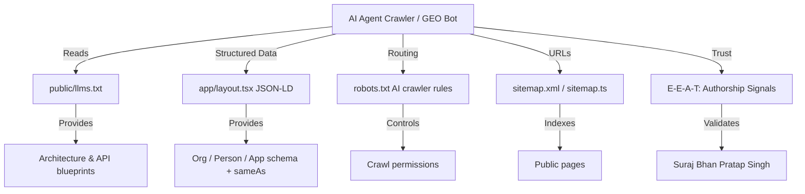

# StudySnap — AI Discoverability Frameworks (Hinglish Guide)

> Is document me 6 modern search/AI discoverability frameworks (AEO, GEO, LLMO, AISEO, E-E-A-T, SEO) implement karne ka plan + current status bata hai. Team ke liye Hinglish me.

## Framework Overview (Ek Nazar)

---

## 1. AEO (Answer Engine Optimization)
**Goal:** Search engines (Perplexity, Gemini, OpenAI Search) ko content se seedha answer mile.

**Implement kaise:** Content structured, concise, markdown-friendly; seedha question ka jawab dena; `llms.txt` me system summary.

**Current status:** `public/llms.txt` me system overview hai; semantic HTML + `h1` hierarchy.
**Aage improve:** Har feature ke liye short "definition + usage" blocks in llms.txt.

---

## 2. GEO (Generative Engine Optimization)
**Goal:** Generative engines ko site ka content easily cite/extract kare.

**Implement kaise:** Structured data (JSON-LD), clean markdown docs, consistent metadata, sitemap/robots accurate.

**Current status:** Sitemap, robots basic; docs (English) ready.
**Aage improve:** Root docs (Hinglish) + enhanced llms.txt + JSON-LD.

---

## 3. LLMO (Large Language Model Optimization)
**Goal:** LLM crawlers me `.md` files as entry-point (llms.txt/llms-full.txt).

**Implement kaise:**
- `llms.txt` → overview + key URLs + short feature descriptions.
- `llms-full.txt` → pura API/data/component contract (bada markdown).
- LLM code-generators ke liye clear API routes + params.

**Current status:** basic llms.txt hai.
**Aage improve:** Full sections + `.well-known/ai-plugin.json` (optional).

---

## 4. AISEO / AI Search Optimization
**Goal:** Traditional SEO + AI-agent readability dono.

**Implement kaise:**
- Dynamic `sitemap.ts`, rich `robots.txt` (AI crawlers allow/disallow).
- Semantic HTML (`<main>`, `<article>`, heading hierarchy), `aria-label` (WCAG 2.1 AA).
- Fast Core Web Vitals → PageSpeed 90+.

**Current status:** Basic sitemap/robots; layout semantic.
**Aage improve:** Dynamic sitemap + AI crawler rules + structured data (implement isi session me).

---

## 5. E-E-A-T (Experience, Expertise, Authoritativeness, Trustworthiness)
**Goal:** Search engines authorship/trust verify kare.

**Implement kaise:**
- `layout.tsx` metadata: `authors`, `creator`, `publisher`, `<meta name="author">` sab **same string**: `Suraj Bhan Pratap Singh - Full-Stack AI Engineer`.
- JSON-LD `Person` + `Organization` with `sameAs` (GitHub/LinkedIn/Portfolio) — identity cross-platform consistent.
- Author bio page (/about) with credentials (optional).
- Consistent identity har jagah (GitHub, Vercel, package.json, README, docs).

**Current status:** Metadata consistent, author string set. JSON-LD pending.
**Aage improve:** Add JSON-LD + sameAs links.

---

## 6. SEO (Search Engine Optimization)
**Goal:** Google/Bing indexing, Core Web Vitals, discoverability.

**Implement kaise:**
- Dynamic sitemap (`/sitemap.xml`), robots.txt (sitemap reference + private route disallow).
- `robots` metadata (index/follow) + googleBot max-image-preview large, max-snippet -1.
- PageSpeed: font `display: swap`, image optimization, preconnect, bundle splitting, compression.
- Search Console + Bing Webmaster submit.
- Accessibility (WCAG), best practices (secure headers, manifest, PWA).

**Current status:** Good metadata, secure headers, manifest, PWA.
**Aage improve:** Dynamic sitemap (implement), robots enhancements, PageSpeed audit.

---

## Implementation Checklist (Is Session)
- [x] Root `docs/` folder (Hinglish docs — 8 files)
- [x] Dynamic sitemap via `app/sitemap.ts`
- [x] Enhanced `robots.txt` (AI crawlers + private routes + sitemap)
- [x] Enhanced `llms.txt`
- [x] JSON-LD structured data in layout
- [x] sameAs identity consistency
- [ ] PageSpeed audit + fixes
- [ ] Search Console + Bing submission (manual, dashboard)

---

## AI Crawlers (robots.txt Policy)
- **Allow:** Common crawlers (Google, Bing) + friendly AI (AI/SEO indexed pages).
- **Disallow:** `/api/*` (backend), `/sign-in`, `/sign-up` (private/session), raw docs.
- **Optional:** `GPTBot`, `ClaudeBot`, `PerplexityBot`, `Google-Extended` pe policy control.

> Note: `llms.txt` initiative = **LLM files spec** (llmstxt.org). Ye har LLM crawler ka standard "site entry-point" hai.