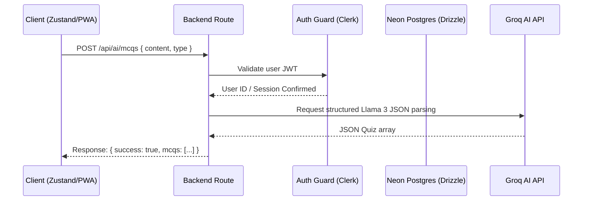

# StudySnap — API Specifications (Hinglish Guide)

> Is document me StudySnap ke backend endpoints, auth, request/response examples aur error handling ka pura detail hai. Team ke internal use ke liye Hinglish me.

## Endpoint Flows



---

## Auth Overview
- Saare `/api/notes`, `/api/voice-notes`, `/api/ai` routes **Clerk authMiddleware** se protected hain.
- Header: `Authorization: Bearer <clerk_token>`
- Production me backend fake/mock data kabhi serve nahi karta — fail-fast validation hota hai.

---

## 1. Study Notes Endpoints

### `GET /api/notes`
Active study notes fetch karta hai (authenticated student ke liye).
- **Query params:**
  - `limit` (optional, `1..200`) — response bound karne ke liye. Present hone par cache se kabhi serve nahi hota.
  - `since` (optional, ISO datetime) — **delta-sync cursor**. Present hone par sirf wahi notes return hote hain jinke `updatedAt` `since` ke bad hai, plus ek `cursor` (result ka sabse naya `updatedAt`, ya koi row qualify na ho toh `since`). Aagli pull me ye `cursor` wapas pass karo incremental sync ke liye. Absence par full pull (cacheable) milta hai.
- **Response (full/`limit` mode):**
  ```json
  {
    "success": true,
    "notes": [
      {
        "id": "uuid-string",
        "title": "Quantum Mechanics Intro",
        "content": "Content body...",
        "tags": "physics,math",
        "isPinned": false,
        "isFavorite": true,
        "categoryId": "category-uuid",
        "folderId": "folder-uuid",
        "nextRevisionAt": "2026-07-15T12:00:00Z"
      }
    ]
  }
  ```
- **Response (delta mode, `?since=<ts>`):** notes shape same + `cursor` field:
  ```json
  { "success": true, "notes": [ ... ], "cursor": "2026-08-05T14:30:00.000Z" }
  ```
- **Errors:** `400` invalid `limit`/`since`; `500` failure par.

### `POST /api/notes`
Single note upsert karta hai. Agar `id` diya hai aur exist karta hai toh update; warna insert.
- **Payload:**
  ```json
  {
    "id": "uuid-optional",
    "title": "New Title",
    "content": "Rich text body...",
    "tags": ["chem", "valency"],
    "categoryId": "cat-uuid-or-null",
    "folderId": "folder-uuid-or-null",
    "isPinned": false,
    "isFavorite": false
  }
  ```
- **Response:** `{ "success": true, "note": { ... } }`
- **Errors:** `409` stale upsert (freshly-deleted note) ya id kisi aur account ka hai.

### `POST /api/notes/verify-pin`
Locked note ka PIN verify karta hai.
- **Payload:** `{ "noteId": "uuid", "pin": "1234" }`
- **Response:** `{ "success": true }` ya `{ "success": false }`
- **Errors:** `404` note ya PIN nahi hai; `429` rate-limited (pinLimiter).

### `DELETE /api/notes?id=<note_id>`
Specific note delete karta hai.
- **Response:** `{ "success": true }`
- Note delete hone par linked voice notes (Cloudinary audio) purge hote hain.
- **Errors:** `400` invalid id; `500` failure.

---

## 2. Subject Categories Endpoints

### `GET /api/notes/categories`
User ke preset + custom subject categories list karta hai.
- **Response:** `{ "success": true, "categories": [...] }`

---

## 3. Voice Notes Endpoints

### `GET /api/voice-notes`
Authenticated user ke voice notes list karta hai (`createdAt DESC`).
- **Response:** `{ "success": true, "voiceNotes": [...] }`
- **Errors:** `503` DB configure nahi hai; `500` failure.

### `POST /api/voice-notes`
Voice note upload karta hai (multipart, field name `file`).
- **Supported MIME:** `audio/webm`, `audio/mp4`, `audio/ogg`, `audio/mpeg`, `audio/wav`
- File ki **magic-byte signature** verify hoti hai (declared MIME se match karna chahiye).
- **Limit:** `MAX_FILE_SIZE_BYTES` (config me).
- **Errors:** `400` file missing/validation; `413` size zyada; `415` unsupported type ya mismatch; `404` linked note not owned; `409` id kisi aur account ka; `503` storage/DB configured nahi; `500` upload/save failure.

### `DELETE /api/voice-notes?id=<voice_note_id>`
Voice note delete karta hai (Cloudinary asset bhi best-effort destroy).
- **Response:** `{ "success": true }` (idempotent)

---

## 4. Artificial Intelligence Endpoints

> In sab routes par **aiLimiter** bhi lagta hai (rate limit). Request/response logs me sirf operational metadata aata hai, user content kabhi log nahi hota.

### `POST /api/ai/chat`
Groq chat agent ko messages bhejta hai.
- **Payload:**
  ```json
  { "messages": [ { "role": "user", "content": "Explain photosynthesis simply." } ] }
  ```
- **Response:**
  ```json
  { "success": true, "message": { "role": "assistant", "content": "..." }, "_duration": 123 }
  ```

### `POST /api/ai/summarize`
Active note summarize karta hai.
- **Payload:** `{ "title": "Math Note", "content": "Formulas..." }`
- **Response:** `{ "success": true, "summary": "Concise markdown...", "_duration": 123 }`

### `POST /api/ai/mcqs`
Content se MCQs ya flashcards generate karta hai (`type` field ke hisab se).
- **Payload:** `{ "title": "History", "content": "Dates...", "type": "mcq" }` — `type: "flashcard"` par flashcards return hota hai.
- **Response (mcq):**
  ```json
  { "success": true, "mcqs": [ { "question": "...", "options": [...], "answer": 0, "explanation": "..." } ] }
  ```
- **Response (flashcard):** `{ "success": true, "flashcards": [...] }`

### `POST /api/ai/translate`
Content ko translate karta hai.
- **Payload:** `{ "content": "...", "targetLanguage": "hindi" | "english" }`
- **Response:** `{ "success": true, "translatedText": "...", "_duration": 123 }`

---

## 5. System Endpoints

### `GET /api/health`
Server health check.
- **Response:**
  ```json
  { "success": true, "status": "healthy", "timestamp": "<ISO>", "version": "1.0.0" }
  ```

### `POST /api/webhooks/*`
Clerk webhooks receive karta hai (Svix signature verified, `CLERK_WEBHOOK_SECRET`).

---

## Error Response Format
- Saare errors standardized: `{ "success": false, "error": "<message>" }`
- `400` malformed/validation, `413` body too large, `404` not found, `409` conflict, `429` rate limit, `500` server error, `503` not configured.
- Malformed JSON body → `400`; oversized payload → `413` (framework error status preserve hota hai).
