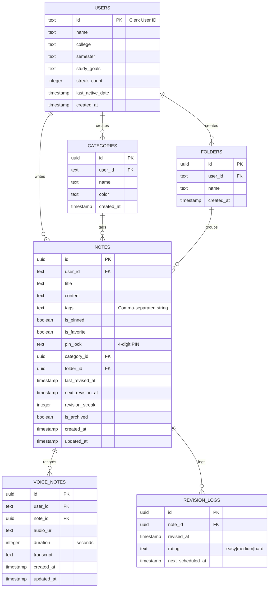

# StudySnap — Database Schema & Relations (Hinglish Guide)

> Is document me Neon PostgreSQL ke tables, field types, foreign keys, aur indexes ka detail hai (Drizzle ORM me defined). Actual source: `BACKEND/src/db/schema.ts`.

## Entity Relationship Diagram (ERD)

---

## 1. Table Definitions

### `users`
Student goals, profile, aur streak records track karta hai.
- `id` (text, primary key): Clerk User ID.
- `name` (text, notNull): Full name.
- `college` / `semester` / `studyGoals` (text, nullable): Meta details.
- `streakCount` (integer, default 0): Lagataar active study days.
- `lastActiveDate` (timestamp, nullable): Streak check stone last run date.

### `categories`
Notes ko subjects me group karta hai (Physics, Chemistry, custom).
- `id` (uuid, primary key): Unique ID.
- `userId` (text, notNull): Creator ka FK.
- `name` (text, notNull): Subject name.
- `color` (text, nullable): Hex accent code (jaise `#0061A4`).
- **Index:** `categories_user_idx` on `userId`.

### `folders`
Notes ko hierarchical structures me organize karta hai.
- `id` (uuid, primary key).
- `userId` (text, notNull): Creator FK.
- `name` (text, notNull): Folder label.
- **Index:** `folders_user_idx` on `userId`.

### `notes`
Rich-text note details + metadata + spaced-repetition tracking.
- `id` (uuid, primary key).
- `userId` (text, notNull): Owner FK.
- `title` (text, notNull), `content` (text, notNull).
- `tags` (text, nullable): Comma-separated.
- `isPinned` / `isFavorite` (boolean, default false).
- `pinLock` (text, nullable): 4-digit PIN (hashed).
- `categoryId` (uuid, nullable): → `categories.id` (`onDelete: set null`).
- `folderId` (uuid, nullable): → `folders.id` (`onDelete: cascade`).
- `lastRevisedAt` / `nextRevisionAt` (timestamp, nullable).
- `revisionStreak` (integer, default 0).
- `isArchived` (boolean, default false).
- `createdAt` / `updatedAt` (timestamp, default now).
- **Index:** `notes_user_archived_updated_idx` on `(userId, isArchived, updatedAt)` — primary listing query (user + is_archived filter, `updated_at DESC` sort) ko filesort ke bina serve karta hai. (Migration `0001`)

### `voiceNotes`
Notes se judi voice recordings.
- `id` (uuid, primary key).
- `userId` (text, notNull): Owner FK.
- `noteId` (uuid, nullable): → `notes.id` (`onDelete: cascade`).
- `audioUrl` (text, notNull): Cloudinary secure URL.
- `duration` (integer, notNull): Seconds.
- `transcript` (text, nullable).
- `createdAt` / `updatedAt` (timestamp).
- **Index:** `voice_notes_user_created_idx` on `(userId, createdAt)`.

### `revisionLogs`
Spaced-repetition events maintain karta hai.
- `id` (uuid, primary key).
- `noteId` (uuid, notNull): → `notes.id` (`onDelete: cascade`).
- `revisedAt` (timestamp, default now).
- `rating` (text): `easy`, `medium`, `hard`.
- `nextScheduledAt` (timestamp, notNull).
- **Index:** `revision_logs_note_idx` on `noteId`.

---

## 2. Migrations
- Drizzle migrations `BACKEND/drizzle/` folder me hai, journal `_journal.json` me tracked.
- Naya index migration: `0001_cooing_steve_rogers.sql` (drop `notes_user_archived_idx`, create `notes_user_archived_updated_idx`).
- Apply: `cd BACKEND && npm run db:migrate`

---

## 3. Indexing Strategy (Performance)
- **categories_user_idx, folders_user_idx:** Har query user-scoped hai — bina index ke full scan hota.
- **notes_user_archived_updated_idx:** Listing query ke liye (filter + sort dono index se).
- **voice_notes_user_created_idx:** `WHERE user_id = ? ORDER BY created_at DESC`.
- **revision_logs_note_idx:** Revision rows per-note query/cleanup ke liye.
