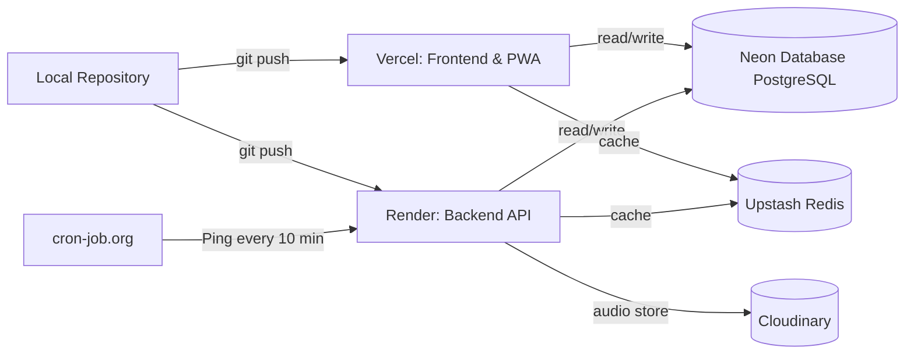

# StudySnap — Deployment & Hosting Guide (Hinglish)

> Frontend Vercel, backend Render, database Neon Postgres par deploy hota hai. Is document me env vars, CI/CD, aur keep-alive setup ka step-by-step detail hai.

## Deployment Pipelines



---

## 1. Environment Variables

### Backend (Render) — Server-side
| Variable | Required? | Description |
|---|---|---|
| `DATABASE_URL` | ✅ Yes | Neon Serverless PostgreSQL URI. **Miss hota toh production boot nahi hota.** |
| `CLERK_SECRET_KEY` | ✅ Yes | Clerk private key (live `sk_live_`). **Required in production.** |
| `CLERK_PUBLISHABLE_KEY` | Yes | Clerk public key (live `pk_live_`). |
| `CLERK_WEBHOOK_SECRET` | Optional | Svix signing secret (Clerk → Webhooks). |
| `GROQ_API_KEY` | Optional* | Groq access token. Missing → AI requests `503`. |
| `UPSTASH_REDIS_URL` / `UPSTASH_REDIS_TOKEN` | Optional | Redis cache credentials. |
| `CLOUDINARY_CLOUD_NAME` / `_API_KEY` / `_API_SECRET` | Optional* | Voice-note audio storage. Missing → uploads `503`. |
| `BREVO_API_KEY` / `BREVO_SENDER_EMAIL` | Optional | Email (future use). |
| `FRONTEND_URL` | Optional | Vercel frontend URL (CORS origin). |
| `PORT` | No | Backend port (default `4000`). |
| `NODE_ENV` | Yes | `production` on Render. |

> **Production fail-fast:** `NODE_ENV=production` me `DATABASE_URL` ya `CLERK_SECRET_KEY` missing/blank → boot abort hota hai, mock/dev mode me kabhi nahi degrade hota. `GROQ_API_KEY`, Cloudinary, `FRONTEND_URL`, `CLERK_WEBHOOK_SECRET` miss hone par boot **nahi** rukta — wo request-time `503` dete hain.

### Frontend (Vercel)
| Variable | Scope |
|---|---|
| `NEXT_PUBLIC_CLERK_PUBLISHABLE_KEY` | Client/Server (public) |
| `CLERK_SECRET_KEY` | Server only (NO `NEXT_PUBLIC_` prefix — secret hai) |
| `NEXT_PUBLIC_BACKEND_URL` | Client (Render backend URL — CSP connect-src allow karta hai) |
| `NEXT_PUBLIC_BACKEND_URL` optional redirect vars | Client |

---

## 2. Database: Neon Postgres
1. [Neon Console](https://neon.tech/) → naya project.
2. Region + **PostgreSQL 16** select karo.
3. Connection String (pooled) copy karo → `DATABASE_URL`.
4. Migrations apply karo:
   ```bash
   cd BACKEND && npm run db:migrate
   ```

---

## 3. Frontend: Vercel
1. [Vercel](https://vercel.com/) → **Add New Project**.
2. GitHub repo link karo.
3. Framework Preset: **Next.js**.
4. Section 1 ke env vars configure karo (Vercel UI me; secret key bina public prefix).
5. **Deploy** dabao.

> Search Console / indexing ke liye sitemap + verification ka **Section 6** dekho.

---

## 4. Backend: Render + Keep-Alive
Render free tier 15 min inactivity par spin down karta hai, isliye keep-alive:
1. [Render](https://render.com/) → **Web Service**.
2. Repo link → build `npm run build` (backend) / start.
3. Section 1 ke vars set karo.
4. Service URL note karo.
5. [cron-job.org](https://cron-job.org/) → **Create Cronjob** → Render URL (`/api/health`) → **Every 10 minutes** → Save.

---

## 5. API Key Rotation (Security)
- Ye keys **secret** hain — kabhi commit nahi karna (`.env` files gitignore'd hain).
- Key rotate karne par **dono jagah** update karo: `BACKEND/.env` + `FRONTEND/.env.local` (local) **aur** Render + Vercel dashboards (production).
- Rotation ke baad service redeploy karo.

---

## 6. SEO / Indexing Setup (Search Console & Bing)
Sitemap + robots.txt ready hone ke baad:
1. **Google Search Console** ([search.google.com/search-console](https://search.google.com/search-console)) → Resource add (property) → verification (Vercel/HTML tag ya DNS).
2. Sitemap submit karo: `https://<your-domain>/sitemap.xml`
3. **Bing Webmaster Tools** ([bing.com/webmasters](https://www.bing.com/webmasters)) → site import/verify → sitemap submit karo.
4. Key pages ka indexing request karo.
5. GSC/Bing alerts on karo (issues tracking ke liye).

---

## 7. Custom Domain (optional)
- Vercel → Domain → custom domain add.
- Production frontend domain me `FRONTEND_URL` (backend) aur sitemap/robots URLs update karna yaad rakho.
