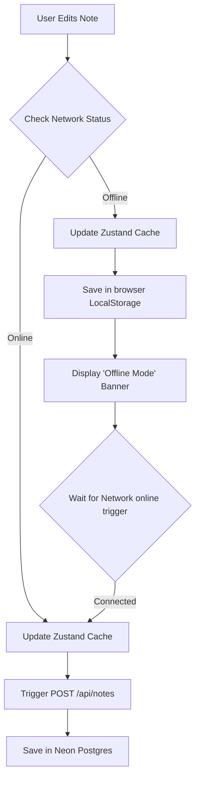

# StudySnap — Error Handling & Edge Cases (Hinglish Guide)

> App me handle kiye gaye failure modes, error boundaries, browser API exceptions, aur sync edge cases ka detail. Hinglish me.

## Offline State Data Flow

---

## 1. Network Failure & Offline Operation
- **Situation:** Student ne internet khol diya / flight me hai.
- **Handling:**
  - App `online`/`offline` window events listen karta hai → header **"Offline Mode"** red badge dikhata hai.
  - Notes/categories/folders CRUD locally Zustand persistent store me commit hota hai + localStorage me serialize.
  - API requests defer/optimistically skip hote hain. Connectivity wapas aane par batch reconciliation update Neon me sync karta hai.

---

## 2. Mic Permission Lockout (STT & Voice Notes)
- **Situation:** Mic block hai browser me.
- **Handling:**
  - `navigator.mediaDevices.getUserMedia` try-catch me wrapped.
  - Permission reject → clear system alert; `isRecording: false`, `isListening: false` reset.
  - Buttons inactive state me wapas jaate hain, browser crash nahi hota.

---

## 3. Web Speech Synthesis Limitations (TTS)
- **Situation:** Note content me HTML tags / emojis / foreign scripts jo SpeechSynthesis tod de.
- **Handling:**
  - TTS parser HTML tags regex se strip karta hai (`/<[^>]*>/g`) speech se pehle.
  - Voice fail / `onerror` → crash catch, `isSpeaking` clear, button UI reset.

---

## 4. Locked Note Security Concealment
- **Situation:** Note 4-digit PIN se locked, par summary feed me content dikh jaye.
- **Handling:**
  - Notes list rendering me `pinLock != null` check karta hai.
  - PIN active → content masked: `"[Encrypted / Password Protected Notes]"`, data tabhi dikhta hai jab sahi PIN diya jaye.

---

## 5. Blank Title / Content Saves
- **Situation:** Editor khula aur turant wapas aa gaye → empty notes.
- **Handling:**
  - Blank title default **"Untitled Note"** hota hai.
  - Auto-save handler dono (title + content) blank drafts ignore karta hai — DB me orphan nodes nahi.

---

## Backend Edge Cases (Advanced)

## 6. Sticky Delete Guard (Stale POST revival)
- **Situation:** Note DELETE hone ke baad bhi ek reload-surviving POST wapas AA kar note ko re-insert kar de.
- **Handling:** 10-min TTL bounded in-memory registry. Freshly-deleted note ka upsert-by-id reject (`409`). DELETE failure par guard rollback hota hai.

## 7. Voice Upload Hardening
- **Situation:** Client ne `audio/webm` bolkar arbitrary bytes bhej diye.
- **Handling:** MIME allowlist + **magic-byte signature** check (WebM/Ogg/WAV/MP4/MP3) — fake payload reject (`415`).
- Oversized file → `413`. Malicious long transcript → truncated (kabhi reject nahi).

## 8. Cross-Account ID Collision
- **Situation:** Caller-supplied note/voice-note id kisi aur account ka hai.
- **Handling:** Upsert guard (`setWhere` / availability check) — `409` reject, doosre user ka row kabhi touch nahi hota.

## 9. AI Fail-Closed & Rate Limiting
- **Situation:** Production me AI/DB misconfigured.
- **Handling:** AI misconfig → `503` (generic), upstream `429` → real `429`. DB missing voice → `503`. User content logs me kabhi nahi.

## 10. Cache Behavior
- **Situation:** Notes full list vs slice vs delta.
- **Handling:** Full pull (no limit/since) hi cache hota hai; slice/delta hamesha live. Stripped shape (bina pinLock) hi Redis me jata hai — sensitive material kabhi cache nahi.
