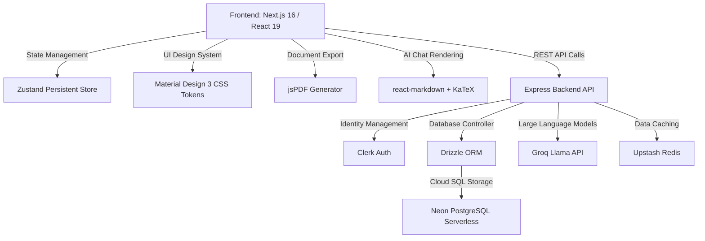

# StudySnap — Technology Stack (Hinglish Guide)

> Ye document StudySnap web application me kaunsi technologies, libraries, APIs aur frameworks use hote hain ye detail me batata hai. Team ke internal use ke liye Hinglish me likha gaya hai.

## Core Technologies (Mool Technologies)

---

### 1. Framework & Core UI
- **Framework:** Next.js 16 (App Router use karta hai, TypeScript `@types/node` aur `@types/react` ke saath)
- **Library:** React 19
- **Design System:** Material Design 3 (root-level custom CSS variables `globals.css` me standardized hai)
- **Icons:** `lucide-react` library

### 2. State & Caching (Offline Compatibility)
- **Global State Store:** Zustand (persistent middleware `localStorage` browser me use karta hai offline support ke liye)
- **Local Database:** HTML5 Web Storage API
- **Cloud Caching:** Upstash Redis (backend me, `@upstash/redis`)

### 3. Database Layer
- **DB Hosting:** Neon PostgreSQL (Serverless instance)
- **ORM Schema Client:** Drizzle ORM (`drizzle-orm` + `drizzle-kit` command utilities)
- **Database Driver:** `@neondatabase/serverless`

### 4. Integration APIs & Services
- **Authentication:** Clerk Identity (`@clerk/nextjs` auth routing)
- **AI Core:** Groq API SDK (`groq-sdk`), backend `ai` service se expose
- **PDF Core:** `jspdf` (client-side vector document rendering)
- **Math & Markdown:** `katex`, `react-markdown`, `remark-gfm`, `remark-math`, `rehype-katex`
- **Notifications & Streaks:** Canvas-Confetti (`canvas-confetti`)
- **Backend Services (Express):** Drizzle ORM, Redis cache, Groq AI, Clerk `@clerk/backend`

---

## Version Notes
- Frontend package version: `1.1.0`
- Backend package version: `1.1.0`
- Production fail-fast: `NODE_ENV=production` me `DATABASE_URL` aur `CLERK_SECRET_KEY` hone **required** hai warna backend boot nahi hota.
