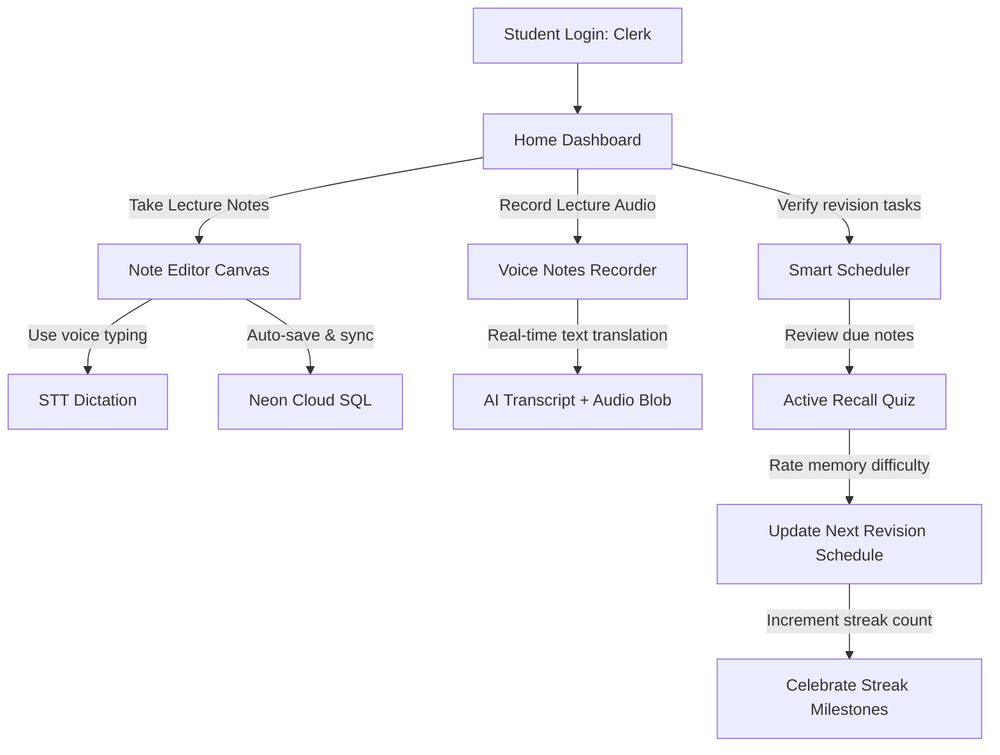

# StudySnap — Workflow Guides (Hinglish)

> Is document me student interaction patterns (login se revision tak) aur team dev workflow ka detail hai.

## Student Lifecycle Journey

---

## 1. Onboarding & Registration
1. App khulta hai → landing app-bar.
2. **Login** → Clerk overlay (Google, Email/Password, reset options).
3. Successful validation → dashboard me name, college, study metrics.

---

## 2. Note Capture Workflow
1. **Create Note** → editor.
2. Title + notes type karo.
3. Optionally:
   - **Dictate** mic button → browser permission → speech editor me cursor par.
   - **Listen Note** speaker button → TTS note padhta hai.
4. Editor har **1.5s** par auto-save.
5. **Tags** + **Subject Category** (Physics) + **Study Folder** (Semester 1).

---

## 3. Study Revisions & Spaced Repetition
1. Home dashboard par due-for-revision notes highlight.
2. **Revision Mode** tab.
3. Due note select → review.
4. Memory rate karo:
   - **Hard:** 1 din me next review
   - **Medium:** 3 din
   - **Easy:** 7 din
5. Streak count increment → canvas-confetti celebration.

---

## 4. AI Study Features
- **AI Tutor:** Chat, summarize, MCQ, flashcards, translate.
- Content note se direct generate karo (title + content bhejo).

---

## 5. Dev Team Workflow

### Branch & Git
- Dev `master` par push; production push → Vercel/Render auto-deploy.
- Commits me repo style follow karo (conventional, task references jaise "Day N Task M").

### Testing
- Backend: `cd BACKEND && npm test` (71 tests — auto-discover via glob).
- Frontend: `cd FRONTEND && npm test` (222 tests).
- E2E: `npm run e2e` (Playwright guest flows).

### Lint / Build
- Backend: `cd BACKEND && npm run lint && npm run build`.
- Frontend: `cd FRONTEND && npm run lint && npm run build`.

### Release Checklist
1. Backend + frontend tests green.
2. Lint clean.
3. Production env vars updated (no missing keys).
4. Migration applied (`db:migrate`).
5. Commit + push → watch auto-deploy.
6. Health check `/api/health` → 200.
7. (SEO) sitemap/robots verified in Search Console.

---

## 6. SEO / Search Console Workflow (Team)
1. sitemap.ts + robots.txt deploy ho.
2. GSC + Bing me site verify.
3. Sitemap submit karo.
4. Naye content/features ke baad naye sitemap URLs update + re-index request.